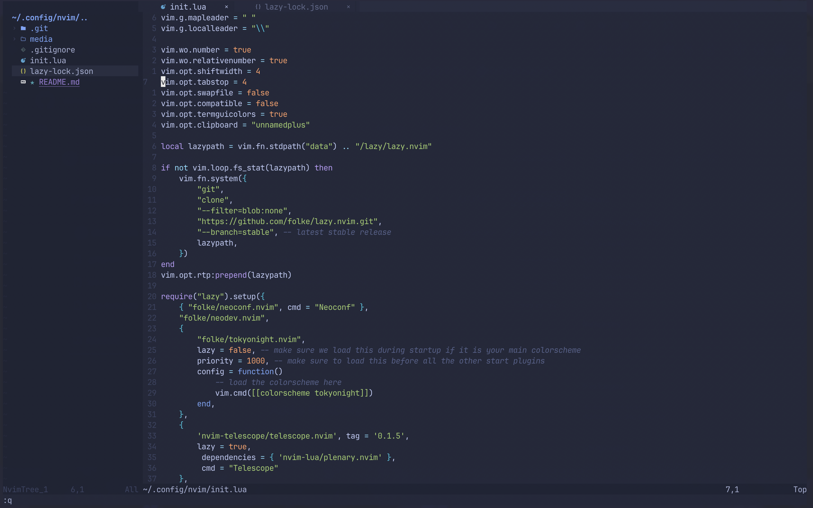

# Dotfiles


Clone dotfiles directory and create symlinks with stow:
```
stow fish nvim tmux alacritty
```
To remove any links, use:
```
stow -D fish nvim tmux alacritty
```

Here's a look at the nvim config (outdated):


